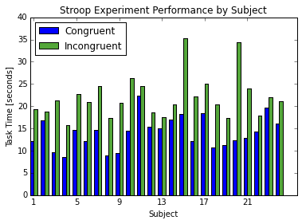
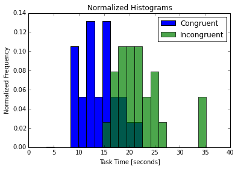

#### 1. What is our independent variable? What is our dependent variable?
The independent variable in the Stroop experiment is the congruency between the word colors and their names. The total time taken to read all of the words is the dependent variable. 

#### 2. What is an appropriate set of hypotheses for this task? What kind of statistical test do you expect to perform? Justify your choices.
Since this is a dependent samples, repeated measures design where we don't know any of the parameters of the population, I will be using a t-test to verify the results. The null hypothesis is that the difference between the means of the task times for each condition is equal to zero and the alternative is that the difference is not equal to zero. The difference in means of the samples will be used as the estimate for the difference in means of the populations. I will be using a more conservative approach with a two-tailed t-test and an alpha value of 0.05. 

#### 3. Report some descriptive statistics regarding this dataset. Include at least one measure of central tendency and at least one measure of variability.
The mean and standard deviation for the congruent test were 14.05 and 3.56 seconds, respectively. For the incongruent test I calculated 22.02 and 4.79 seconds. The difference in means is quite large and is a good indicator that the incongruent colors may impact the time taken to complete the test. 

The range of the samples varied quite a bit as well with the congruent test having a range of 13.70 seconds and 19.56 seconds for the incongruent test. 

(Table of descriptive statistics in [iPython notebook cell 1](P1_stroop_experiment.ipynb))

#### 4. Provide one or two visualizations that show the distribution of the sample data. Write one or two sentences noting what you observe about the plot or plots.
Figure 1 is a side by side bar chart of each subjects performance under both the congruent and incongruent condition. The difference for each subject can clearly be seen in this view, as well as the general trend in a higher min/max of the incongruent set. 
###### Figure 1 Bar chart of results

It also appears that the mean of the congruent set is much lower, which is reflected in the normalized histograms of Figure 2. 

###### Figure 2 Normalized Histograms

#### 5. Now, perform the statistical test and report your results. What is your confidence level and your critical statistic value? Do you reject the null hypothesis or fail to reject it? Come to a conclusion in terms of the experiment task. Did the results match up with your expectations?
Given that each test has 24 samples, we have 23 degrees of freedom. With an alpha of 0.05 the t-critical is +/- 2.069. Given that the t-value is -8.02, we reject the null, suggesting that performance on the incongruent test is significantly less than that of the congruent version. I also calculated Cohen's d which had a value of -1.637 further confirming the effect of the congruency of the words and colors. 

(Statistics available in [iPython notebook cell 3](P1_stroop_experiment.ipynb))
(Hand calculations available in [attached Excel file](stroopdata_calculations.xlsx))

#### 6. Optional: What do you think is responsible for the effects observed? Can you think of an alternative or similar task that would result in a similar effect? Some research about the problem will be helpful for thinking about these two questions!
Our visual association with colors is very strong and difficult to ignore. One of my favorite alternatives is a task where you have to press a series of bubbles in order based on the numeric value inside the bubble. It is related to the Stroop effect in that the size of the bubbles is incongruent with the value of the bubble, making it difficult to press them in the right order. I haven't seen this used in an experiment, but it would be interesting to see the results of such a test. 